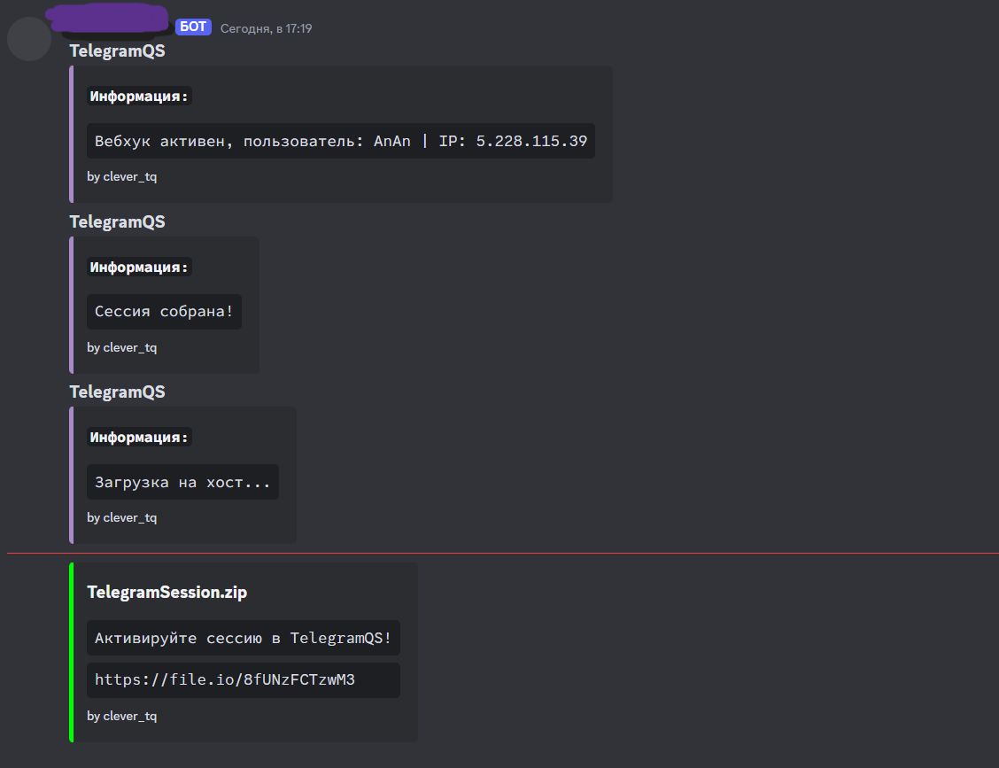

# TelegramQS


## Описание
Данный софт создан для входа в телеграм аккаунт без двухфакторной аутентификации (2FA) по сессии.

## Функционал
Вход по сессии телеграм (tdata).
(*Логи приходят на ваш вебхук)

## Установка
Чтобы установить проект, выполните следующие шаги:

1. Клонируйте репозиторий:
   ```bash git clone https://github.com/chclever/TelegramQS.git/

2. Запустите TelegramQS.py:
    ```cd TelegramQS

3. Запустите файл. 
    ```python TelegramQS.py


## Фото

